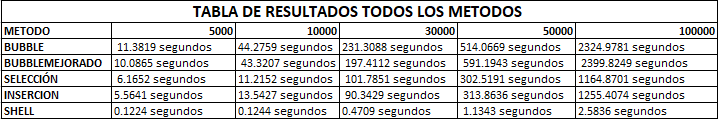

# Práctica Teoria De La Complejidad

## 📌 Información General

- **Título:** Práctica Teoria De La Complejidad
- **Asignatura:** Estructura de Datos
- **Carrera:** Computación
- **Estudiantes:** Xavier Ortega, dave siguencia
- **Fecha:** 11/5/2025
- **Profesor:** Ing. Pablo Torres

---

## 🛠️ Descripción

Este proyecto implementadiferentes algoritmos de ordenamiento en python, incluyendo:
- Método Burbuja
- Método Burbuja Mejorado
- Método Selección
- Método Inserción
- Método Shell

## 🚀 Ejecución

Para ejecutar el proyecto:

1. Compila el código:
    ```bash
    python App.py
    ```
2. Ejecuta la aplicación:
    ```bash
    python App
    ```

## 🧑‍💻 Ejemplo

Tamano: 5000, Algoritmo: bubble, Tiempo: 11.3819 segundos
Tamano: 5000, Algoritmo: bubbleMejorado, Tiempo: 10.0865 segundos
Tamano: 5000, Algoritmo: seleccion, Tiempo: 6.1652 segundos
Tamano: 5000, Algoritmo: insercion, Tiempo: 5.5641 segundos
Tamano: 5000, Algoritmo: shell, Tiempo: 0.1224 segundos
Tamano: 10000, Algoritmo: bubble, Tiempo: 44.2759 segundos
Tamano: 10000, Algoritmo: bubbleMejorado, Tiempo: 43.3207 segundos
Tamano: 10000, Algoritmo: seleccion, Tiempo: 11.2152 segundos
Tamano: 10000, Algoritmo: insercion, Tiempo: 13.5427 segundos
Tamano: 10000, Algoritmo: shell, Tiempo: 0.1244 segundos
Tamano: 30000, Algoritmo: bubble, Tiempo: 231.3088 segundos
Tamano: 30000, Algoritmo: bubbleMejorado, Tiempo: 197.4112 segundos
Tamano: 30000, Algoritmo: seleccion, Tiempo: 101.7851 segundos
Tamano: 30000, Algoritmo: insercion, Tiempo: 90.3429 segundos
Tamano: 30000, Algoritmo: shell, Tiempo: 0.4709 segundos
Tamano: 50000, Algoritmo: bubble, Tiempo: 514.0669 segundos
Tamano: 50000, Algoritmo: bubbleMejorado, Tiempo: 591.1943 segundos
Tamano: 50000, Algoritmo: seleccion, Tiempo: 302.5191 segundos
Tamano: 50000, Algoritmo: insercion, Tiempo: 313.8636 segundos
Tamano: 50000, Algoritmo: shell, Tiempo: 1.1343 segundos
Tamano: 100000, Algoritmo: bubble, Tiempo: 2324.9781 segundos
Tamano: 100000, Algoritmo: bubbleMejorado, Tiempo: 2399.8249 segundos
Tamano: 100000, Algoritmo: seleccion, Tiempo: 1164.8701 segundos
Tamano: 100000, Algoritmo: insercion, Tiempo: 1255.4074 segundos
Tamano: 100000, Algoritmo: shell, Tiempo: 2.5836 segundos

## EJEMPLO DE ADICIÓN DE DATOS EN ESTE INFORME


## TABLA DE RESULTADOS TODOS LOS METODOS 

##  CONCLUCIONES CON TERMINOLOGIA DE NOTACION 

- A través del proceso de implementación, se adquirió una comprensión más profunda de los pasos de cada algoritmo de ordenación. Este conocimiento va más allá de simplemente conocer los algoritmos, ya que permite traducirlos a código funcional.
se identifica el algoritmo más eficiente en base al número de iteraciones.    
El análisis cuantitativo de los tiempos de ejecución permitió identificar claramente a Shell Sort como el algoritmo más eficiente entre los evaluados, especialmente para conjuntos de datos más grandes. Esto concuerda con la idea de que los algoritmos con menor complejidad temporal generalmente requieren menos operaciones (iteraciones) para ordenar un conjunto de datos determinado.

 - El ordenamiento de burbuja presento el peor rendimiento, con tiempos de ejecución que aumentaron a medida que aumentaba el tamaño de la matriz. Esto concuerda con su complejidad temporal de O(n^2), donde el número de operaciones escala cuadráticamente con el tamaño de la entrada

 - El ordenamiento de burbuja mejorado mostró cierta mejora al incorporar un mecanismo para terminar anticipadamente si no se producen intercambios en una pasada, lo que podría alcanzar O(n) en el mejor de los casos (datos ya ordenados). Sin embargo, su dificultad promedio y en el peor de los casos sigue siendo O(n^2), lo que limita su escalabilidad.

 - El ordenamiento por selección también mostró un comportamiento O(n^2), con un desempeño levemente mejor que el ordenamiento de burbuja en la mayoría de los casos, pero aún escalando deficientemente con entradas más grandes.

 - El ordenamiento por inserción, si bien tiene una difcultad en el peor de los casos de O(n^2), tuvo un rendimiento relativamente bueno con conjuntos de datos más pequeños. Esto probablemente se deba a su mejor rendimiento en el mejor de los casos de O(n) cuando la entrada está casi ordenada.

 - Shell Sort superó consistentemente a todos los demás algoritmos, especialmente al aumentar el tamaño de entrada. Este rendimiento superior se atribuye a su complejidad temporal, que es mejor que O(n^2), aunque la complejidad exacta depende de la secuencia de gaps utilizada

##  CONCLUCION XAVIER ORTEGA

 - El análisis de los tiempos de ejecución dio como resultado a Shell Sort como el algoritmo más eficiente entre los evaluados, especialmente para conjuntos de datos más grandes. Esto concuerda con la idea de que los algoritmos con menor complejidad temporal generalmente requieren menos operaciones (iteraciones) para ordenar un conjunto de datos determinado.